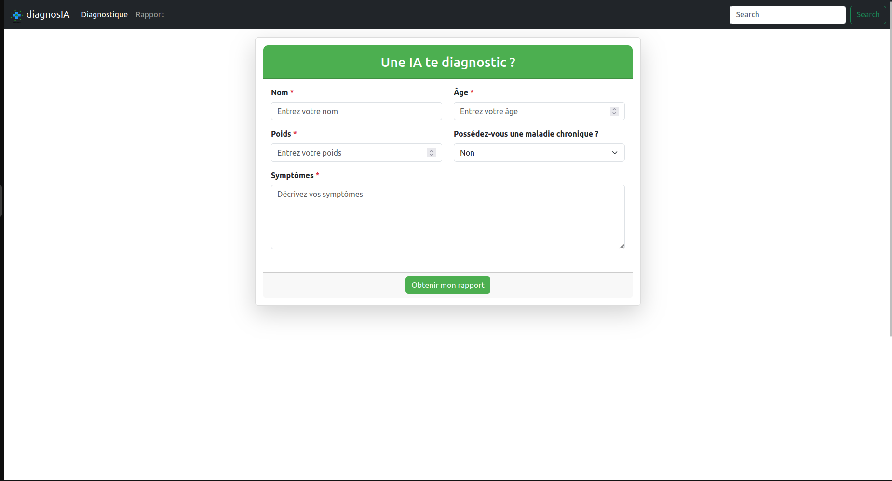
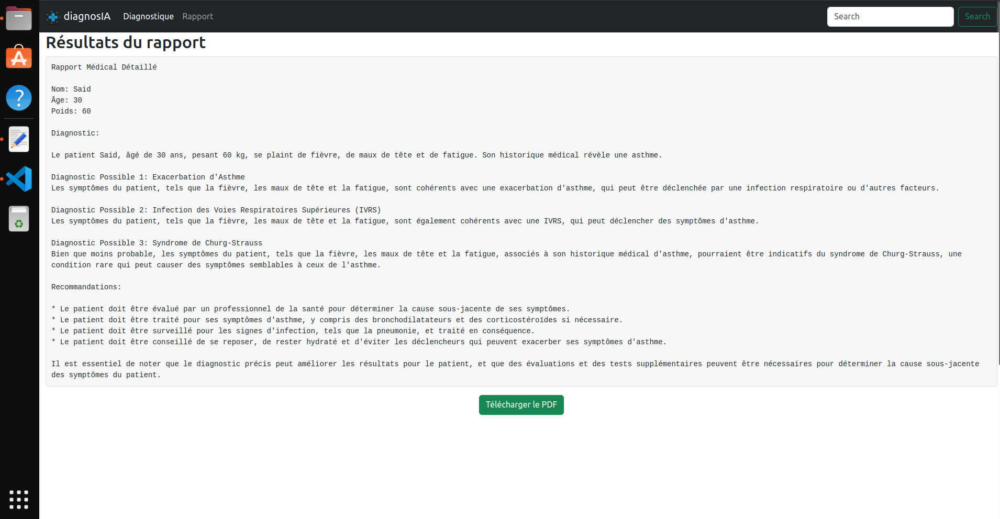

# Diagnostic IA avec Crew AI

Ce projet est une application de diagnostic médical utilisant l'intelligence artificielle (IA). L'application est constituée de deux parties principales : un frontend développé en Angular et un backend développé en Python. Le backend utilise Crew IA pour le diagnostic des patients via une API POST avec flask. Le frontend consomme cette API pour soumettre les informations des patients.

## Table des Matières

- [Présentation du Projet](#présentation-du-projet)
- [Prérequis](#prérequis)
- [Installation et Configuration](#installation-et-configuration)
- [Démarrage du Projet](#démarrage-du-projet)
- [Utilisation](#utilisation)


## Présentation du Projet

Ce projet est conçu pour fournir un service de diagnostic médical à l'aide d'agents IA développés avec le framework Crew IA. Le frontend est une interface utilisateur développée en Angular permettant de saisir des informations sur les patients et de soumettre ces informations à une API backend. Le backend, développé en Python, utilise Crew IA pour analyser les données et renvoyer un diagnostic par une api flask.

## Prérequis

Avant de commencer, assurez-vous d'avoir installé les éléments suivants :

- **Node.js** (pour le frontend Angular) : [Téléchargez Node.js](https://nodejs.org/)
- **Python 3.x** (pour le backend) : [Téléchargez Python](https://www.python.org/)
- **pip** (pour installer les dépendances Python)
- **venv** (pour gérer l'environnement virtuel Python)

## Installation et Configuration

### Configuration du Backend

1. **Clonez le Répertoire du Projet**

   ```bash
   git clone https://github.com/chrfsa/dignosAI
   cd diagnosAI/back
   ```
2. **Créez et Activez un Environnement Virtuel**

   ```bash
   python -m venv venv
   source venv/bin/activate  # Sur Windows : venv\Scripts\activate
   ```

3. **installez les dépendences**
    ```bash
    pip install -r requirements.txt
    ```
4. **Configurez les Variables d'Environnement**
Assurez-vous que toutes les variables d'environnement nécessaires sont configurées. Vous pouvez créer un fichier .env dans le répertoire racine du backend avec les variables requises. dans ce projet les variable qu'on a utiliser c'est les api de groq et de serper.

### Configuration du Frontend

1. **Naviguer vers le répertoire du frontend**
    ```bash
    cd front
    ```
2. **installer les dépendences**
    ```bash
    npm intall
    ```
## Démarrage du projet
### **Démarrer le backend**

    ```bash
    python main.py
    ```
### ***Démarrer me frontend**

    ``bash
    ng serve
    ```
    
## Utilisation
pour utiliser DiagnosAI il faut lancer le back et le front ensemble, apres ouvrez un navigateur web et allez à http://localhost:4200/.

Utilisez le formulaire pour entrer les informations sur les patients, telles que les symptômes, l'âge, le poids, et l'historique médical. Ces informations seront envoyées au backend via une API POST.

Le backend analysera les données avec Crew IA et renverra un diagnostic basé sur les informations fournies. Les résultats seront affichés et vous pouvez le télécharger.

### Interface


